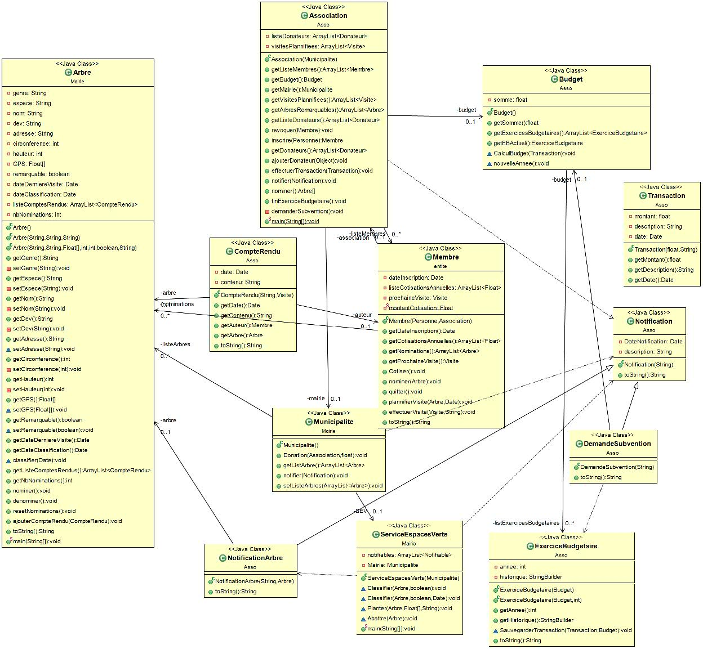

<div align="center" id="top"> 
  

  &#xa0;

  <!-- <a href="https://projectjava.netlify.app">Demo</a> -->
</div>

<h1 align="center">Project Java ET3</h1>

<p align="center">
  

  

  

  

  <!--  -->

  <!--  -->

  <!--  -->
</p>

<!-- Status -->

<!-- <h4 align="center"> 
	🚧  Project Java 🚀 Under construction...  🚧
</h4> 

<hr> -->

<p align="center">
  <a href="#:dart:-Description">Description </a> &#xa0; | &#xa0; 
  <a href="Structure">Structure</a> &#xa0; | &#xa0;
  <a href="#:rocket:-Technologie">Technologies</a> &#xa0; | &#xa0;
  <a href="#:checkered_flag:-Installation">Installation</a> &#xa0; | &#xa0;
  <a href="#Collaboration">Collaborations</a> &#xa0; | &#xa0;
  <a href="#memo-license">Merci</a> &#xa0; | &#xa0;
  <a href=[Java-doc](../doc/Index.html)</a> &#xa0; | &#xa0;
  <a href="https://github.com/Bilail" target="_blank">Auteur</a>
</p>

<br>

## :dart: Description ##

Le but de ce projet est de créer un site de gestion d'abre à travers une assocaiation.

*	Gestions des arbres et de leurs caractéristiques
*	Classement arbre remarquable 
*	Vote des membres 
*	Visite des arbres
*	Compte rendu
*	Gestion du budget
*	Subventions
*	Rapport
* Dépense
*	Notification d’événement 
*	Gestion des membres 
*	Cotisation
*	RGPD

## Structure ##



## :rocket: Technologie ##

Le logiciel est codé entierement en Java


## :checkered_flag: Installation ##

Pour pouvoir installer ce répertoire

```
$ git clone https://github.com/Bilail/project-java.git
$ cd ../path/to/the/file
$ npm install
$ npm start
```

```bash
# Clone this project
$ git clone https://github.com/{{YOUR_GITHUB_USERNAME}}/project-java

# Access
$ cd project-java

# Install dependencies
$ yarn

# Run the project
$ yarn start

# The server will initialize in the <http://localhost:3000>
```

## Collaboration ##

Ce projet a été réalisé par : Natanaël et Bilail

Dans le cadre du Projet Java de Polytech Paris Saclay 

Made with :heart: by <a href="https://github.com/Bilail" target="_blank">Bilail et Natanael</a>

&#xa0;

<a href="#top">Back to top</a>
